[Databend](https://github.com/datafuselabs/databend/) is a next-generation cloud-native data warehouse developed using Rust. It is built on an object storage architecture and features instant scalability, allowing for hundreds of times more computing power to be added within minutes. It provides enterprises with a centralized platform for managing and analyzing big data, integrating object storage and data lakes, and separating computation from storage. By unifying data and providing a single computing entry point for various business applications, Databend enables enterprises to gain accurate business insights and formulate strategies. Experience the cloud service now at: <https://app.databend.com>.

Databend Playground (Community Preview) provides the full functionality of the Databend Community Edition by default. It supports one-click deployment for quick learning and validation of Databend solutions in an experimental environment, making it ideal for novice users to learn Databend's SQL syntax and experience data analysis solutions.

## Databend Playground Subscription

Find Databend Playground in the **KubeSphere Marketplace**.

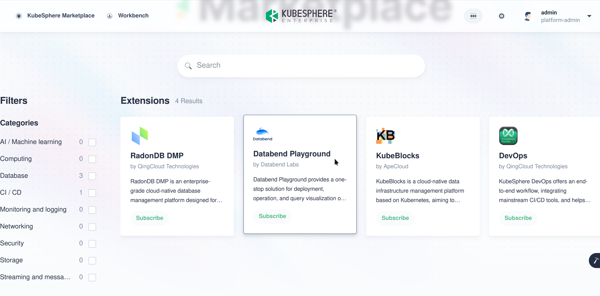

Click the "Subscribe", confirm the information and submit order. Once the order is complete, the subscription will take effect.

## Databend Playground Installation

Back to the extension marketplace in KubeSphere, click Databend Playground to enter the page below. Click the "Install" button on the left to start installing Databend Playground. 

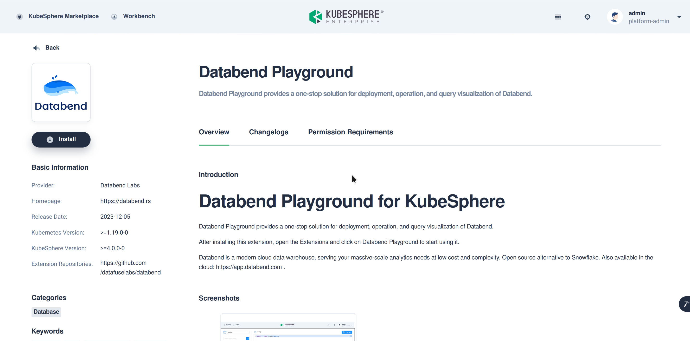

Confirm the default option is v0.1.0 and click the "Next" button. No need to change the extension component configuration, just click the button in the middle of the page "Start Installation" as shown below:

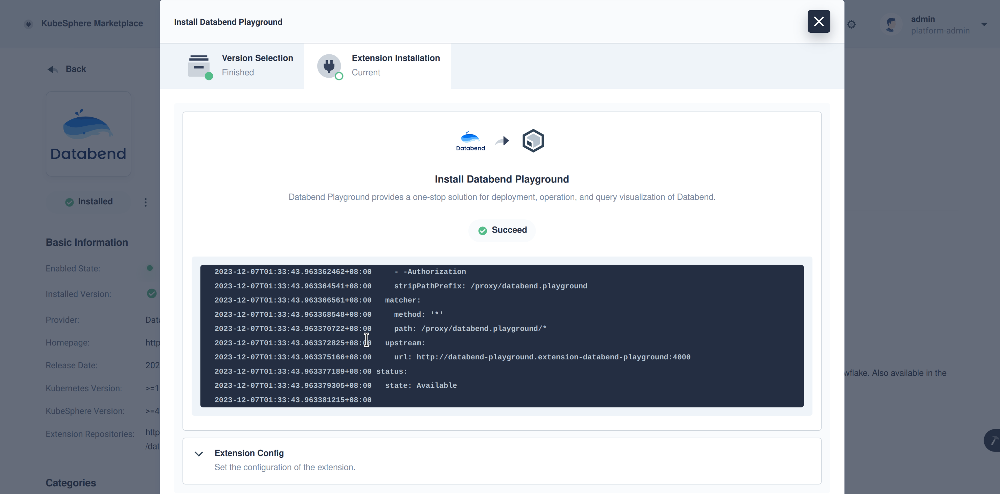

## Databend Playground Usage

Click the "Extension" icon in the upper right corner to find the application entrance of the Databend Playground extension component.

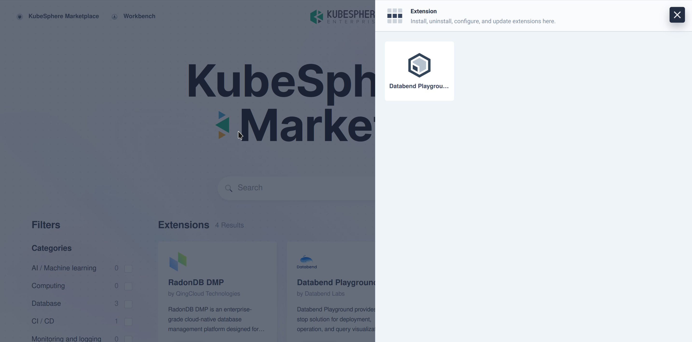

The Databend Playground page is shown below:

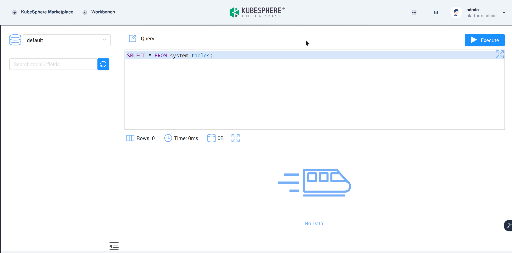

## Databend Playground Function Introduction

### Database Information Display

The left side is the database information display area. After selecting, you can view the tables contained in the database and the column and column data type information contained in each table. **Taking the "tables" table in the "system" database as an example**, it contains information about all tables currently managed by the current Databend instance.

First, select the "system" database in the selector to see there are several system tables in system. 

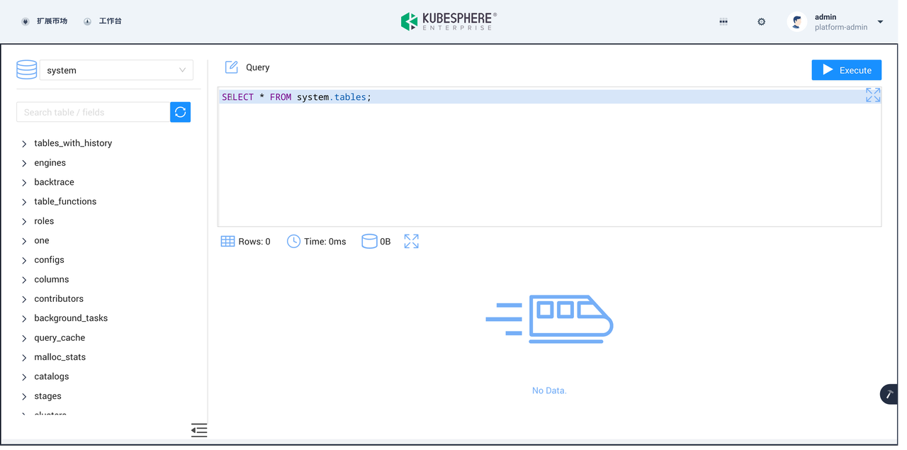

Scroll down and click the arrow to expand the "tables" table to view the field name and data type information of the columns.

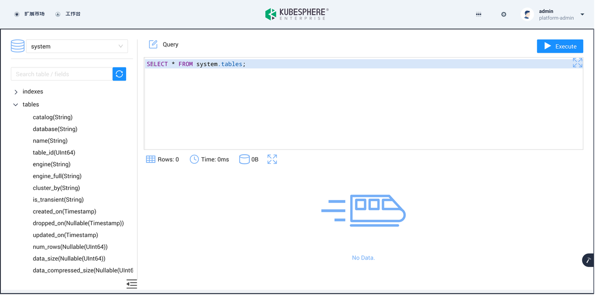

### SQL Query Editing and Results Display 

The SQL query editor is located in the upper right area for writing corresponding queries and executing, supporting syntax highlighting, syntax hints, etc.

The results display area is located in the lower right area, supporting display of result rows and other information.

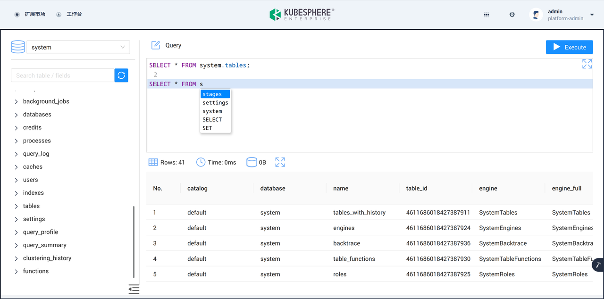

Below are examples **querying the "tables" table and "functions" in the "system" database** to demonstrate the relevant functions:

```Diff
SELECT * FROM system.tables;

SELECT name FROM system.functions LIMIT 10;
```

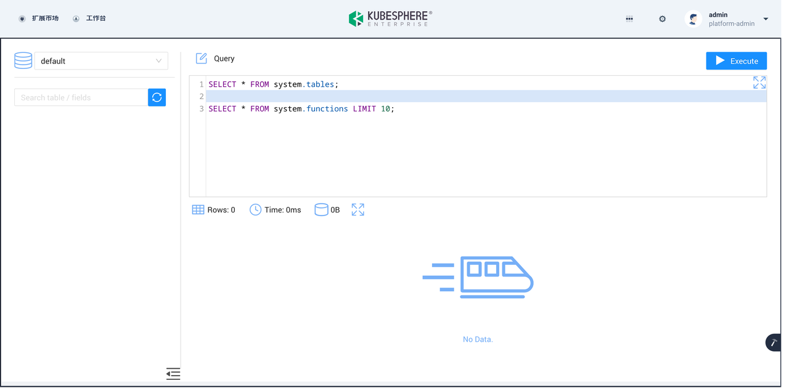

First, write two corresponding query statements, one to query all tables currently owned by the instance, and one to query the function names of the first 10 functions currently supported by the instance.

When the cursor is on the second line, the last SQL statement will be executed by default, which is to query the first 10 supported functions, and the result is shown below:

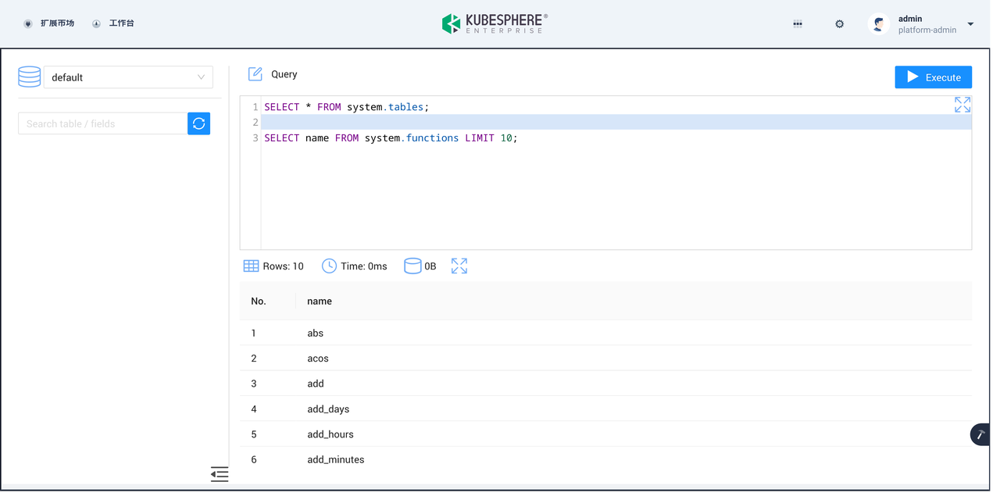

Move the cursor to the first line to select the first query to get all tables currently owned by the instance, and the result is shown below:

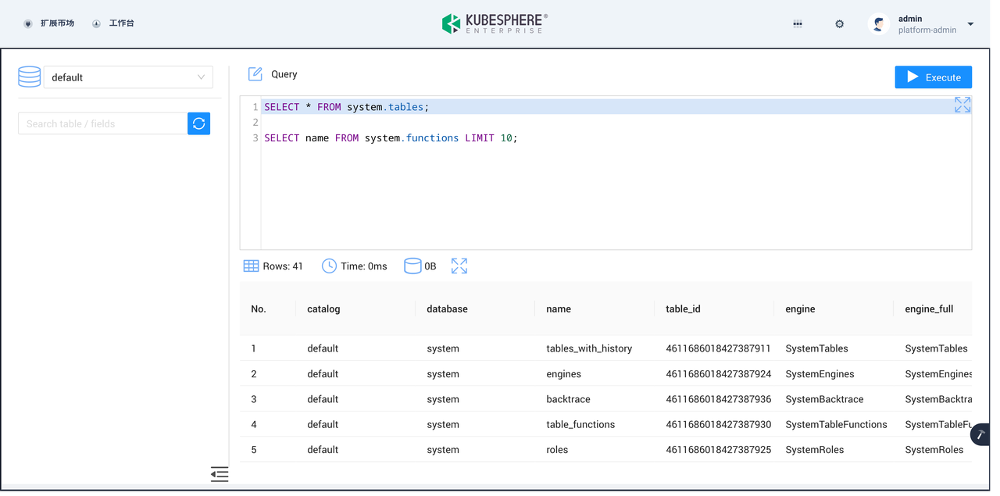

### FAQ

#### What features are supported in the Databend Playground (Community Preview)?

- The Databend Playground (Community Preview) provides all the features of the Databend Community Edition by default. For cluster capabilities and other feature-specific support, please [contact us](https://www.databend.com/contact-us/) for further assistance.

#### What is the deployment scale supported by the Databend Playground (Community Preview)?

- The current version of Databend Playground only supports a single Meta, Query, and Playground deployment.

#### Where can I get more information about Databend?

- For more information about Databend, please visit https://www.databend.com/ .

#### Where can I find the SQL reference manual for Databend?

- The SQL reference manual for Databend can be found at https://docs.databend.com/sql .
