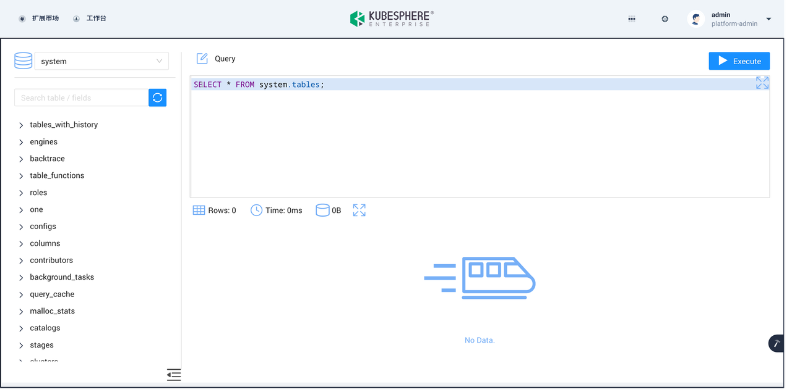
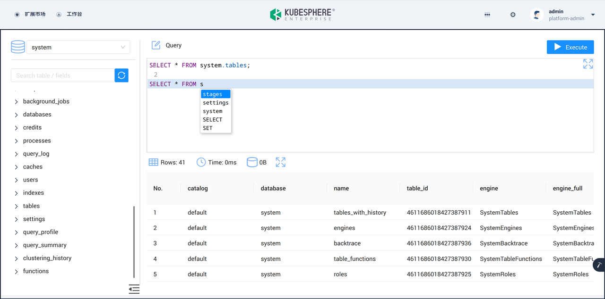
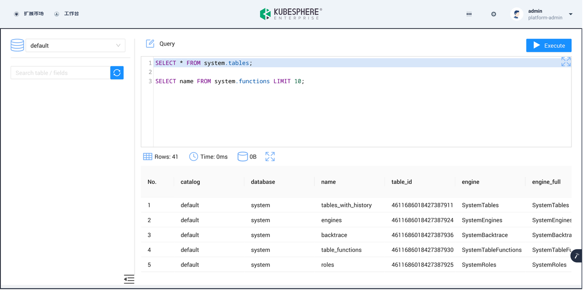

[Databend](https://github.com/datafuselabs/databend/) 是一款使⽤ Rust 研发、完全⾯向云架构、基于对象存储构建的新一代云原⽣数据仓库。具有即时扩缩容能力，能在数分钟内增加数百倍的算力，为企业提供了一个基于对象存储、湖仓一体化、计算和存储分离的大数据管理和分析集中式平台。实现了一份数据，统一计算入口，供多用种业务使用，从而助力企业更准确地洞察业务、制定战略。即刻体验云服务：<https://app.databend.cn> 。

Databend Playground（社区尝鲜版）默认提供 Databend 社区版的全部功能，支持一键部署快速学习和验证 Databend 解决方案的实验环境，非常适合学习 Databend 的 SQL 语法和体验数据分析方案的新手用户。

## Databend Playground 订阅

在 KubeSphere 的拓展市场中找到 Databend Playground 。


点击「订阅」按钮，进入下方页面。


确认信息并点击「提交订单」，在完成订单后，订阅开始生效。


## Databend Playground 安装

回到 KubeSphere 的拓展市场，点击 Databend Playground ，进入下方页面。点击左侧「安装」按钮，即可开始 Databend Playground 的安装。


在「版本选择」界面确认默认选项为 v0.1.0 并点击「下一步」按钮，无需更改扩展组件配置，直接点击页面中间的「开始安装」即可，安装过程如下图所示：


## Databend Playground 使用

点击右上角的「扩展组件」图标，即可找到 Databend Playground 拓展组件的应用入口。


Databend Playground 页面如下图所示：


## Databend Playground 功能说明

### Database 信息展示

左侧区域为 Database 信息展示区，选中后可以查看数据库中包含的 Table ，以及 Table 中包含的 Column 和 Column 对应的数据类型。下面 **以 system 数据库中的 tables 表为例** ，其中包含了当前 Databend 实例所管理的所有表的信息。

首先在选择器中选中 system 数据库，可以看到 system 中存在若干系统表。



向下滚动，找到 tables 表并点击箭头展开，即可查看列的字段名和数据类型相关信息。


### SQL 查询编辑与结果展示

右侧上方区域为 SQL 查询编辑器，可以在界面中编写对应的查询并执行，支持语法高亮、语法提示等功能。

右侧下方区域为结果展示区域，支持显示结果行数等信息。



下面 **以查询 system 数据库中的 tables 表和 functions 为例** ，展示相关功能：

首先编写两条对应的查询语句，一条用于查询当前实例拥有的所有表，一条用于查询 10 条当前实例支持的函数的函数名。

```Diff
SELECT * FROM system.tables;

SELECT name FROM system.functions LIMIT 10;
```


当前光标位于第 2 行，没有对应的 SQL 语句，默认执行查询会执行最后一条 SQL ，即查询 10 条当前实例支持的函数，结果如下图所示：


当光标移动至第一行，可以选中第一条查询，以获得当前实例拥有的所有表，结果如下：



### **FAQ**

#### Databend Playground（社区尝鲜版）支持哪些功能？

- Databend Playground 社区尝鲜版默认提供 Databend 社区版的全部功能。如需要集群能力及其他企业级特性请 [联系 Databend 团队](https://www.databend.cn/contact-us/) 获取进一步支持。

#### Databend Playground 社区尝鲜版支持多大的部署规模？

- Databend Playground v0.1.0 当前只支持单 Meta、单 Query、单 Playground 部署。

#### 从哪里获取 Databend 的相关信息？

- 如需要了解更多关于 Databend 的信息，请访问 https://www.databend.cn/ 。

#### 从哪里获取 Databend 的 SQL 参考手册？

- Databend 的 SQL 参考手册请查阅 https://docs.databend.cn/sql 。